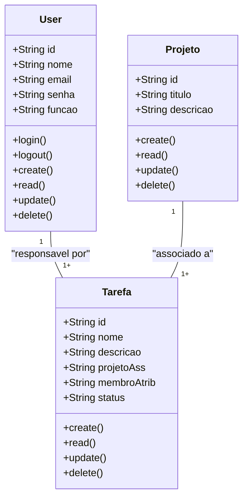
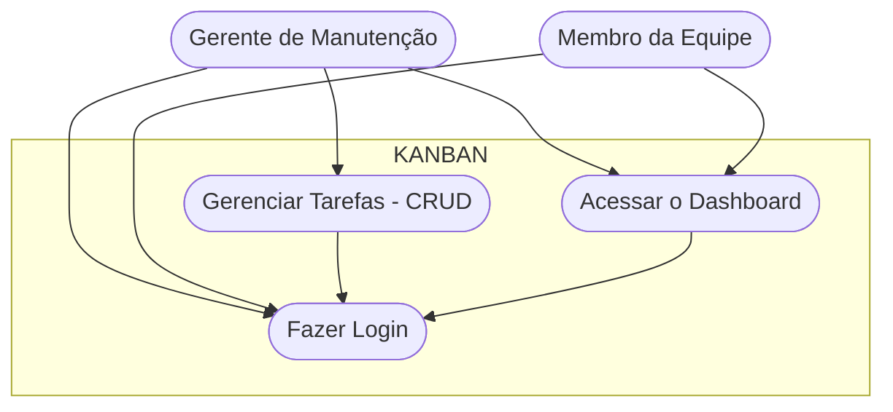
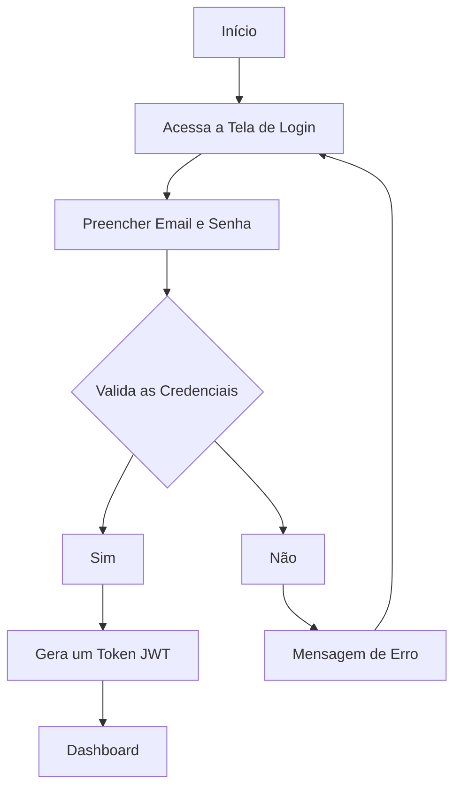

# Gerenciador de Tarefas para Times (Estilo Kanban)

## Escopo 

- ## Público-Alvo:
    - Gerente de Projeto
    - Membro da Equipe

## Diagramas 

1. ### Diagrama de Classes 
    - Usuários;
        - atributos: id, nome, email, senha, função
        - métodos: create, read, update, delete, login, logout
    - Tarefas;
        - atributos: id, titulo, descricao, projetoAss, membroAtrib, status
        - métodos: create, read, update, delete
    - Projetos
        - atributos: id, titulo, descricao

2. ### Diagrama de Caso de Uso
- Atores : Gerente, Membros

- Casos de Uso: 
    - Gerente: Cria projetos, adiciona tarefas e as atribui aos membros da equipe.
    - Membro: Vê as tarefas atribuídas a si e pode mover suas tarefas entre os status.

    Fazer Login -> Antes de Qualquer Ação

3. ### Diagrama de Fluxo 
Detalhar o passo a passo que um usuário segue para se autenticar no sistema e acessar o dashboard
#### Explicação: 
- O Fluxo começa quando o usuário acessa a tela de login 
- Insere as credenciais(email e senha)
- O sistema verifica se as credenciais são válidas 
    - se sim: gera um JWT (token) => dashboard
    - se não: mensagem de erro usuário permanece na tela de login

## Protótipos 
 Figma : https://www.figma.com/design/m0pyffP1MY39V8s50ys4tr/Untitled?node-id=0-1&p=f&t=fMyat4fBL30JDIfo-0